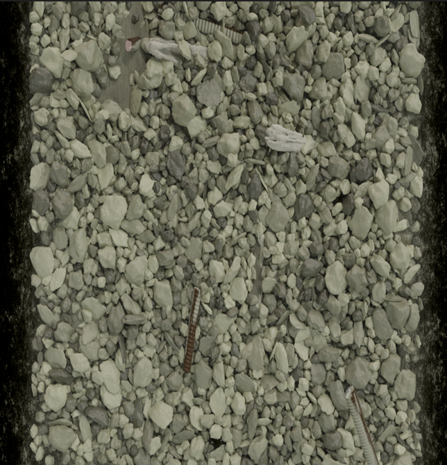
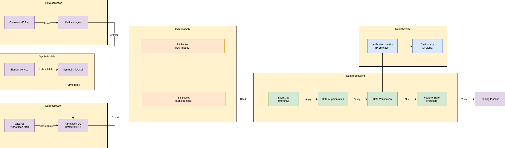
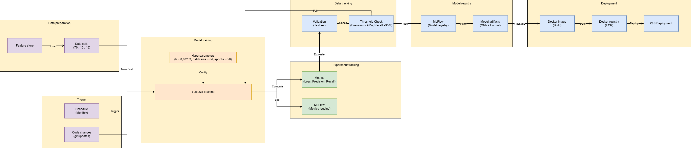
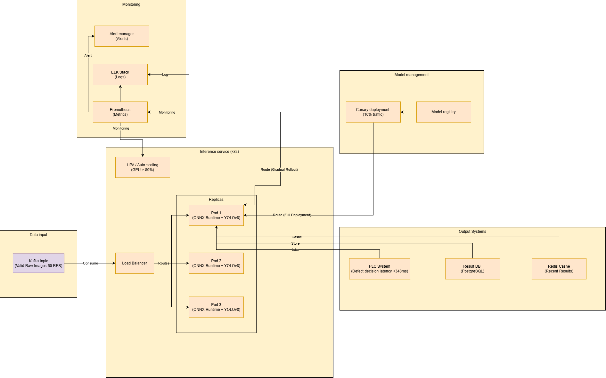

# Домашнее задание: Проектирование ML-системы — Задание 1

**Курс:** Проектирование систем машинного обучения
**Уровень:** 2 курс магистратуры

---

### Работу выполнили:
### - студент М8О-210СВ-24 Барабаш Максим Евгеньевич - 1 и 3 блоки
### - студент М8О-210СВ-24 Малюженец Владислав Александрович - 2 блок

## 1. Введение и постановка задачи

### 1.1. Контекст задачи

В рамках задания требуется спроектировать ML-систему для промышленного контроля качества на высокоскоростной сборочной линии. Система должна автоматически выявлять дефекты изделий по изображениям с камер и передавать решение в исполнительные системы в режиме реального времени.

Основной акцент делается на:

* низкую задержку обработки,
* высокую точность выявления дефектов,
* масштабируемость решения под промышленную нагрузку.

### 1.2. Бизнес-цели

Ключевые бизнес-метрики, которые должна улучшать система:

1. **Снижение пропуска дефектов (Defect Escape Rate)**
   Минимизация количества дефектных изделий, прошедших контроль качества.

2. **Снижение затрат на контроль качества (Cost of Quality)**
   Сокращение доли ручной инспекции и простоев линии.

3. **Стабильность производственного процесса**
   Минимизация остановок линии за счёт быстрого и надёжного принятия решений.

### 1.3. Требования к системе

* **Latency:** задержка принятия решения не должна превышать **348 мс**.
* **Нагрузка:** до **1 124 316 DAU**, пиковая нагрузка — **17 760 RPS**.
* **Масштабируемость:** система должна корректно работать при увеличении числа линий и камер.
* **Отказоустойчивость:** отказ отдельных компонентов не должен приводить к остановке линии.

> Частота **60 fps**, указанная далее в архитектуре, относится к одной камере/линии.
> Пиковая нагрузка **17 760 RPS** достигается при масштабировании системы на множество линий и параллельных потоков инспекции.

---

## 2. Задание

В рамках задания разрабатывается комплексный проект ML-системы, включающий:

* формулировку ML-задачи и выбор модели;
* проектирование архитектуры (data, training, serving);
* расчёты и нефункциональные требования.

---

## Часть 1: Формулировка ML-задачи и выбор модели (Мини-отчёт)

### 1. Определение ML-задачи

**Тип ML-задачи.**
Задача формулируется как **instance segmentation** дефектов на изображении.

Это позволяет:

* принимать бинарное решение `OK / DEFECT`,
* точно локализовать дефект (маска/контур),
* использовать результат для анализа причин брака.

**Таргет (целевая переменная):**

* `defect_present ∈ {0,1}`;
* для каждого дефекта: `{mask_i, bbox_i, class_i, score_i}`.

**Данные для обучения:**

* **Real data:** изображения изделий с камер + метаданные (SKU, партия, камера, освещение).
* **Разметка:** маски дефектов и их классы.
* **Synthetic data:** синтетические изображения с дефектами, сгенерированные в Blender для усиления редких сценариев.

**Формат аннотаций.**
Используется **COCO format (JSON)** для хранения разметки (маски, bounding box, классы).
COCO применяется как:

* формат данных,
* источник предобученных весов для transfer learning.

COCO **не рассматривается как модель**, а только как стандарт и источник pretrain.

---

### 2. Выбор модели

#### Кандидат 1: **YOLOv8**

**Преимущества:** высокий throughput, высокая точность локализации дефектов сложной формы; проще масштабировать.  
**Недостатки:** возможная потеря качества на мелких дефектах.

#### Кандидат 2 (альтернатива): **Mask R-CNN**

**Преимущества:**

* интерпретируемый результат (маска дефекта);
* эффективный transfer learning с COCO.

**Недостатки:**

* более высокая вычислительная сложность;
* повышенные требования к оптимизации при real-time инференсе.

#### Кандидат 3 (альтернатива постановки): **Semantic segmentation (U-Net, DeepLab)**

**Преимущества:** простота архитектуры.
**Недостатки:** отсутствие разделения инстансов дефектов.

---

### 3. Выбранная модель

Для дальнейшего проектирования выбрана **YOLOv8** как наиболее подходящая модель для промышленного контроля качества с требованиями к точной локализации дефектов.

---

### 4. Метрики качества

**Offline-метрики:**

* `AP_mask@[0.5:0.95]`,
* `Recall_defect`,
* `Precision_defect`,
* `AP_box` (дополнительно).

**Целевые пороги (на старте):**

* Recall ≥ 96.5%,
* Precision ≥ 98.2%,
* AP_mask ≥ 0.62.

Финальные пороги фиксируются в Training Pipeline и могут уточняться после пилотного запуска.

---

### 5. Разбиение данных

* Разделение по партиям и временным окнам.
* Пример разбиения:

  * Train — 75%,
  * Validation — 10%,
  * Test — 15%.

---

### 6. Режим инференса

* Критический путь: preprocessing → inference → postprocessing → PLC.
* Все операции записи и логирования выполняются асинхронно.
* Оптимизация модели:

  * экспорт в ONNX,
  * ONNX Runtime / TensorRT,
  * FP16 / INT8,
  * фиксированный размер входа.
### Часть 2: Проектирование архитектуры (Диаграммы в draw.io)

### 1.  **Высокоуровневая архитектура системы.**  
Высокоуровневая архитектура показывает взаимодействие всех основных компонентов системы: от загрузки изображений пользователями до развёртывания обученной модели и мониторинга.

**1.1. Промышленная часть**
- Камеры (60 fps): Высокоскоростные камеры, установленные на конвейере, захватывающие изображения продуктов с частотой 60 кадров в секунду.

**1.2. Offline training** 
- Annotation tool (human labeling, datasets, generated datasets): Инструмент для ручной разметки данных. Операторы или автоматизированные процессы создают размеченные датасеты (например, с bounding box'ами для дефектов). Также могут использоваться синтетически сгенерированные данные для расширения выборки.
- S3 DataLake (Labeled data): Облачное хранилище (например, Amazon S3), куда сохраняются все размеченные данные. Является центральным репозиторием для обучающих данных.
- Training Pipeline (Monthly): Автоматизированный конвейер обучения, который запускается ежемесячно. Он извлекает данные из S3 DataLake, обучает модель YOLOv8 и производит ее валидацию.
- MLFlow (Model registry): Система управления жизненным циклом моделей. Успешно прошедшие валидацию модели регистрируются здесь, что позволяет отслеживать их версии, метрики и управлять их развертыванием.  

**1.3. Kubernetes Cluster** 
- Kafka: Распределенная очередь сообщений, которая буферизует поток изображений, поступающих с камер. Это обеспечивает отказоустойчивость и декуплирование между источником данных и сервисом инференса.
- Inference Service (YOLOv8): Основной сервис вывода (инференса), развернутый в кластере Kubernetes. Он загружает последнюю зарегистрированную модель из MLflow и обрабатывает входящие изображения, выдавая предсказания о наличии дефектов. Сервис масштабируется в зависимости от нагрузки.  

**1.4. Output systems & Monitoring**

- PLC service: Сервис, интегрированный с промышленным контроллером (Programmable Logic Controller). Получает результаты от Inference Service и принимает решение о дальнейшей судьбе продукта на конвейере (например брак).
- Data Storage (Monitoring DB): База данных, где хранятся все результаты инференса, метрики и логи для последующего анализа и генерации отчетов.
- Prometeus: Система сбора и хранения метрик. 
- Grafana: BI, который строит дашборды на основе данных из Prometheus, позволяя инженерам отслеживать состояние системы в реальном времени

### 2.  **Архитектура Data Pipeline.**  
Data Pipeline описывает процесс сбора, разметки и подготовки данных для
обучения моделей.

**2.1. Data collection**

- Cameras (60 fps): Высокоскоростные камеры, захватывающие изображения продуктов с частотой 60 кадров в секунду.
- Kafka images: Распределенная очередь сообщений Kafka, которая получает поток изображений от камер.
- Поток данных: Изображения передаются в Kafka как поток.

**2.2. Synthetic data**

- Blender service: Сервис на основе Blender, который генерирует синтетические изображения продуктов с искусственно созданными дефектами.
Вот пример изображения с мусором из blender:  

- Synthetic dataset: Результат работы сервиса - набор синтетических изображений с уже проставленными метками (например, bounding box'ы или классы).
- Поток данных: Синтетические данные с метками сохраняются (Save labels) в хранилище размеченных данных (S3 Bucket).  

**2.3. Data Storage**  

- S3 Bucket (raw images): Бакет в облачном хранилище, куда архивируются все сырые изображения, поступающие с камер через Kafka.
- S3 Bucket (Labeled data): Отдельный бакет, куда сохраняются все размеченные данные - как ручной разметки, так и синтетические.

**2.4. Data processing**    

- Spark Job: Ежемесячный задача, запускаемая на кластере Apache Spark.
- Data Augmentation: Этап применения аугментаций к данным (повороты, масштабирование, изменение яркости и т.д.) для увеличения размера и разнообразия обучающей выборки.
- Data Verification: Этап проверки качества данных. Проверяется корректность разметки, отсутствие дубликатов, соответствие формату.
- Feature Store: Готовые, обработанные и проверенные данные сохраняются в Feature Store в оптимизированном формате Parquet. 

**2.5. Data tracking**

- Verification metrics: Метрики, полученные на этапе Data Verification, отправляются в систему мониторинга Prometheus. 
- Dashboards (Grafana): Визуализация этих метрик в виде дашбордов в Grafana. Это позволяет data инженерам отслеживать качество входных данных и оперативно реагировать на проблемы.  

### 3.  **Архитектура Training Pipeline.**  
Детализирует автоматизированный процесс обучения, валидации и развертывания модели YOLOv8. 

**3.1. Trigger**
- Schedule (Monthly): Ежемесячный триггер, запускающий pipeline по расписанию. 
- Code changes (git updates): Триггер, активирующийся при коммите кода в репозитории Git. 

**3.2. Data preparation**

- Feature store: Централизованное хранилище признаков, содержащее уже обработанные и проверенные данные (в формате Parquet). 
- Data split (70 : 15 : 15): Данные загружаются (Load) из Feature Store и разбиваются на три выборки:
    - Train (70%) - для обучения модели.
    - Validation (15%) - для подбора гиперпараметров и ранней остановки.
    - Test (15%) - для финальной оценки качества модели.

**3.3. Model training**

- Hyperparameters: Блок, содержащий конфигурацию гиперпараметров для обучения:
    - Learning rate (lr) = 0.00232
    - Batch size = 64
    - Epochs = 50
- YOLOv8 Training: Модель YOLOv8 обучается на GPU-кластере. На вход подаются данные из Data split, а настройки берутся из Hyperparameters.

**3.4. Experiment tracking**

- Metrics (Loss, Precision, Recall): Система собирает ключевые метрики обучения: значение функции потерь (loss), точность (precision) и полноту (recall) на валидационной выборке.
- MLFlow (Metrics logging): Все метрики, гиперпараметры и артефакты логируются в MLflow.

**3.5. Data tracking**

- Validation (Test set): Модель тестируется на независимой тестовой выборке (15% данных), которая не использовалась ни на этапе обучения, ни на этапе валидации.
- Threshold Check (Precision > 97%, Recall > 95%): Проверка, соответствует ли модель установленным бизнес-требованиям. В данном случае:
    - Точность (Precision) должна быть выше 97%.
    - Полнота (Recall) должна быть выше 95%.

**3.6. Deployment**

- MLFlow (Model registry): Успешно прошедшая валидацию модель регистрируется в MLflow Model Registry как Staging или Production. Здесь хранится её версия, метрики и артефакты.
- Model artifacts (ONNX Format): Из MLflow извлекаются артефакты модели, которые конвертируются в оптимизированный формат ONNX для быстрого инференса.
- Docker image (Build): Модель и ее зависимости упаковываются в Docker-образ.
- Docker registry (ECR): Собранный Docker-образ пушится в реестр контейнеров (например, Amazon ECR).
- K8S Deployment: Из реестра контейнеров образ разворачивается в Kubernetes-кластере.

### 4.  **Архитектура Inference Pipeline (Serving).**

Данная диаграмма детализирует архитектуру системы реального времени для обработки изображений с конвейера. 

**4.1. Data input**

- Kafka topic (Valid Raw Images 60 RPS): Топик в Kafka, куда поступают сырые изображения с камер.

**4.2. Inference service (k8s)**

- Load Balancer: Балансировщик нагрузки, который распределяет входящие запросы между несколькими репликами (Pods) для обеспечения высокой доступности и производительности.
- HPA / Auto-scaling (GPU > 80%): Горизонтальный масштабировщик подов (Horizontal Pod Autoscaler). Он автоматически увеличивает или уменьшает количество реплик на основе метрики загрузки GPU (если загрузка превышает 80%).
- Replicas (Pod 1, Pod 2, Pod 3): Несколько реплик сервиса, развернутых в Kubernetes. Каждый под содержит: ONNX Runtime + YOLOv8, оптимизированная для быстрого вывода в формате ONNX, запускается на GPU с помощью ONNX Runtime.
- Механизмы работы:
    - Route (Gradual Rollout): Путь для постепенного развертывания новой версии модели (canary deployment). 
    - Route (Full Deployment): Путь для полного развертывания модели, когда она прошла тестирование и готова обрабатывать весь трафик.
    - Cache: Кэширование результатов инференса в Redis Cache для ускорения обработки повторяющихся запросов.
    - Store: Сохранение результатов в базу данных.
    - Infer: Основной процесс вывода - модель получает изображение и возвращает предсказание.

**4.3. Output Systems**

- PLC System (Defect decision latency <348ms): Промышленный контроллер, получающий решение о дефекте. Система должна принимать решение с задержкой менее 348 мс.
- Result DB (PostgreSQL): Реляционная база данных PostgreSQL, где хранятся все результаты инференса для последующего анализа, аудита и генерации отчетов.
- Redis Cache (Recent Results): Кэш на основе Redis, который хранит последние результаты инференса. Это позволяет быстро отвечать на повторные запросы или проверять недавние решения без перезапуска модели.

**4.4. Model management** 

- Model registry: Реестр моделей, где хранятся все зарегистрированные версии моделей.
- Canary deployment (10% traffic): Механизм канареечного развертывания. Новая модель сначала получает 10% всего трафика. Если она показывает хорошие метрики, то ее можно перевести на полное развертывание (Full Deployment).

**4.5. Monitoring**

- Prometheus (Metrics): Система сбора и хранения метрик. Собирает данные о производительности: задержка (latency), количество запросов в секунду (RPS), загрузка GPU/CPU, количество ошибок.
- ELK Stack (Logs): Стек Elasticsearch, Logstash, Kibana для централизованного сбора, хранения и визуализации логов.
- Alert manager (Alerts): Система управления оповещениями. 

## Часть 3. Расчёты и нефункциональные требования

### 3.1. Принятые допущения для расчётов

Для выполнения расчётов фиксируются следующие допущения, отражающие типичный промышленный сценарий и согласованные с архитектурой системы:

| Параметр                                    | Принятое значение           |
| ------------------------------------------- | --------------------------- |
| Единица запроса                             | 1 инспекция = 1 изображение |
| Частота съёмки одной камеры                 | 60 кадров в секунду         |
| Средний размер изображения после компрессии | 160 КБ                      |
| Размер события с результатами инференса     | ~1.5 КБ                     |
| Доля дефектных изделий                      | ~1.5%                       |
| Доля сохранённых OK-изображений (sampling)  | ~0.2%                       |
| Хранение всех raw-изображений               | 2 суток                     |
| Хранение дефектных изображений              | 12 месяцев                  |
| Хранение метаданных инспекций               | 12 месяцев                  |

Пиковая нагрузка системы достигает **17 760 RPS**, что соответствует параллельной работе множества производственных линий и камер. Частота **60 fps** относится к одной камере и используется как базовая единица масштабирования.

---

### 3.2. Расчёт требований к хранилищу

#### Метаданные инспекций

Каждая инспекция генерирует небольшое событие с результатами инференса (класс, confidence, координаты дефекта, служебные поля).

* В сутки:
  `1 124 316 × 1.5 КБ ≈ 1.7 ГБ / день`
* За год:
  `1.7 × 365 ≈ 620 ГБ / год`

С учётом:

* индексов,
* репликации,
* служебного overhead,

планируем объём хранения метаданных на уровне **~1.5–2 ТБ** (PostgreSQL).

---

#### Изображения

##### (A) Raw-изображения (hot storage, 2 суток)

Raw-изображения сохраняются краткосрочно для:

* расследования инцидентов,

* ручной разметки,

* анализа деградации модели.

* В сутки:
  `1 124 316 × 160 КБ ≈ 180 ГБ / день`

* За 2 суток:
  `~360 ГБ`

---

##### (B) Дефектные изображения (1.5%, хранение 12 месяцев)

* Дефектов в сутки:
  `1 124 316 × 1.5% ≈ 16 865`
* Объём в сутки:
  `16 865 × 160 КБ ≈ 2.6 ГБ / день`
* За год:
  `2.6 × 365 ≈ 950 ГБ`

---

##### (C) Сэмпл OK-изображений (0.2%, 30 дней)

OK-изображения сохраняются выборочно для:

* мониторинга качества модели,

* контроля drift’а.

* OK-сэмпл в сутки:
  `1 124 316 × 0.2% ≈ 2 250`

* Объём в сутки:
  `~360 МБ`

* За 30 дней:
  `~11 ГБ`

---

##### Итог по объектному хранилищу

| Компонент                 |       Объём |
| ------------------------- | ----------: |
| Raw (2 дня)               |    ~0.36 ТБ |
| Дефекты (12 мес.)         |    ~0.95 ТБ |
| OK-сэмпл                  |    ~0.01 ТБ |
| **Итого (чистые данные)** | **~1.3 ТБ** |

С учётом:

* версий датасетов,
* артефактов обучения,
* резервов под рост,

рекомендуемый объём S3-хранилища: **5–8 ТБ**.

---

### 3.3. Расчёт пропускной способности (Throughput)

#### Поток событий (метаданные)

В пике система обрабатывает **17 760 RPS**.

* Поток метаданных:
  `17 760 × 1.5 КБ ≈ 26.6 МБ/с ≈ 213 Мбит/с`
* Kafka с replication factor = 3:
  `~640 Мбит/с`

С запасом по overhead достаточно **канала 1–2 Гбит/с** для событийного контура.

---

#### Поток изображений

Передача **всех изображений** в центральный кластер на пике:

* `17 760 × 160 КБ ≈ 2.8 ГБ/с ≈ 22 Гбит/с`

Такой поток экономически и технически нецелесообразен, поэтому в архитектуре принят следующий подход:

* инференс выполняется локально (edge / ближайший вычислительный кластер),
* в центр передаются:

  * события,
  * дефектные изображения,
  * небольшая выборка OK-кадров.

Для дефектных изображений (1.5%):

* `266 RPS × 160 КБ ≈ 42 МБ/с ≈ 336 Мбит/с`

---

### 3.4. Оценка вычислительных ресурсов (Serving)

Используется **Mask R-CNN**, оптимизированная для инференса:

* ONNX Runtime / TensorRT,
* FP16,
* фиксированное разрешение входа.

Типовые характеристики на одном GPU (NVIDIA T4 / L4):

* средний инференс: **40–70 мс**,
* устойчивый throughput: **12–20 изображений/с**.

#### Масштабирование по линиям

Одна камера:

* 60 fps ≈ 60 RPS,
* требуется **3–5 GPU-реплик** с запасом.

Общая пиковая нагрузка:

* `17 760 / 60 ≈ 296 камер`

Таким образом, вычислительные ресурсы планируются **по числу линий и камер**, а не по глобальному RPS, что соответствует промышленной практике.

---

### 3.5. Латентность и попадание в SLA

Критический путь инференса:

| Этап                         |       p95, мс |
| ---------------------------- | ------------: |
| Захват и декодирование кадра |         10–20 |
| Preprocessing                |         10–15 |
| Inference (Mask R-CNN, GPU)  |         40–70 |
| Postprocessing               |         10–20 |
| Передача решения в PLC       |           1–5 |
| **Итого**                    | **71–130 мс** |

Даже при неблагоприятных условиях система укладывается в SLA **348 мс** с существенным запасом.

---

### 3.6. Масштабируемость и надёжность

#### Масштабируемость

* Горизонтальное масштабирование inference-сервисов (Kubernetes + HPA).
* Партиционирование Kafka по `line_id / camera_id`.
* Независимое масштабирование обучения и инференса.
* Объектное хранилище без жёстких ограничений по объёму.

#### Надёжность

* Stateless inference pods (быстрый рестарт).
* Буферизация данных через Kafka.
* Canary deployment моделей.
* Асинхронная запись результатов и изображений.
* При деградации предпочтение отдаётся **ложной отбраковке**, а не пропуску дефекта.

---

### 3.7. Риски и меры по их снижению

* **Drift данных:** мониторинг статистик изображений, регулярное переобучение.
* **Редкие дефекты:** синтетические данные, активное обучение.
* **Разные SKU:** параметризация пайплайна и порогов по типам изделий.

---

## Список источников

## Список источников

1. Лекционные материалы курса **«Проектирование систем машинного обучения»**.
2. He K., Gkioxari G., Dollár P., Girshick R. *Mask R-CNN.* ICCV, 2017.
3. Microsoft COCO: Common Objects in Context. [https://cocodataset.org/](https://cocodataset.org/)
4. ONNX Runtime Documentation. [https://onnxruntime.ai/docs/](https://onnxruntime.ai/docs/)
5. Apache Kafka Documentation. [https://kafka.apache.org/documentation/](https://kafka.apache.org/documentation/)
6. MLflow Documentation. [https://mlflow.org/](https://mlflow.org/)
7. CVAT — Computer Vision Annotation Tool. [https://github.com/cvat-ai/cvat](https://github.com/cvat-ai/cvat)
